# Praktikum 8: PHP dan Database MySQL

<strong>Repository ini dibuat untuk memenuhi tugas Pemrograman Web</strong>
| <strong>Nama</strong>      | <strong>Riris Naomi Gurning</strong>  |
| ----------- | ----------- |
| <strong>NIM</strong>     | <strong>312010190</strong>       |
| <strong>Kelas</strong>   | <strong>TI.20.A.1</strong>        |

# Langkah-langkah Praktikum 8 "PHP dan Database MySQL"

1. Langkah pertama menyiapkan XAMPP 
 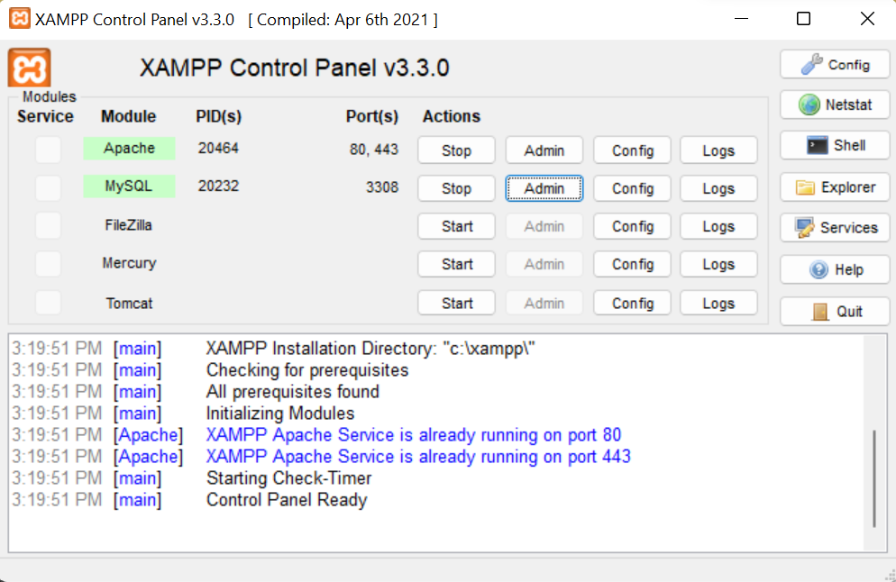

2. Setelah muncul XAMPP, langkah selanjutnya menjalankan MySQL. Dengana Klik start Apache dan MySQL, kemudian klik admin pada bagian MySQL.
 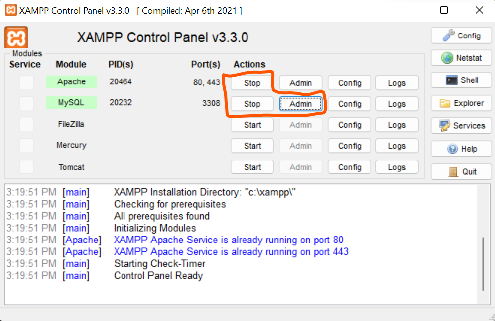<p>Kemudian buka
melalui browser: http://localhost/phpmyadmin/</p>Akan muncul seperti ini:
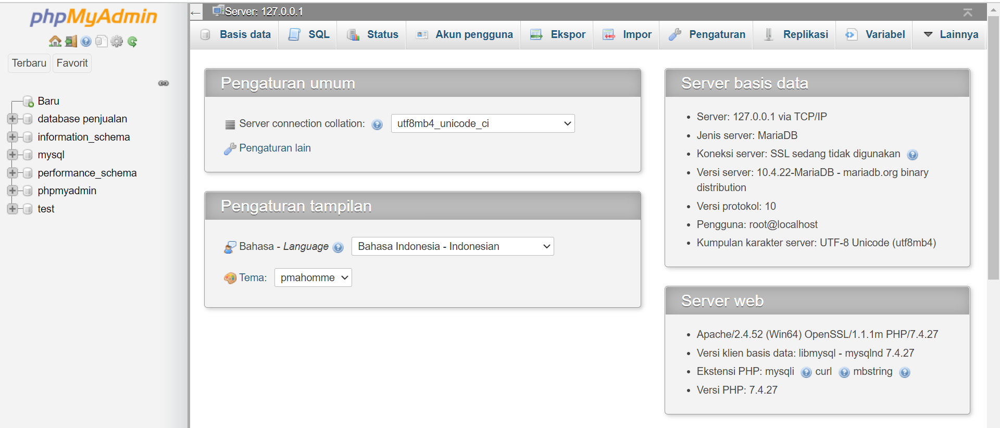

3. Setelah muncul seperti gambar diatas, langkah selanjutnya yaitu <b>Membuat Database baru di phpmyadmin dengan nama latihan1</b>
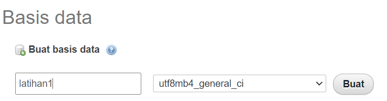
<br>Bisa juga dengan cara ketik ```<b>CREATE DATABASE latihan1;```</b>(didalam konsul)</br>
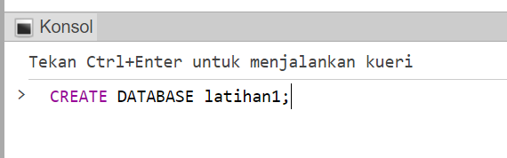

4. Langkah selanjutnya membuat tabel dengan format 
```php
CREATE TABLE data_barang ( id_barang int(10) auto_increment Primary Key,
kategori varchar(30),
nama varchar(30),
gambar varchar(100),
harga_beli decimal(10,0),
harga_jual decimal(10,0),
stok int(4)
);
```
<br>format dapat diletakkan di konsol atau SQL</br>
<br>Ini tampilan di Konsol:</br>
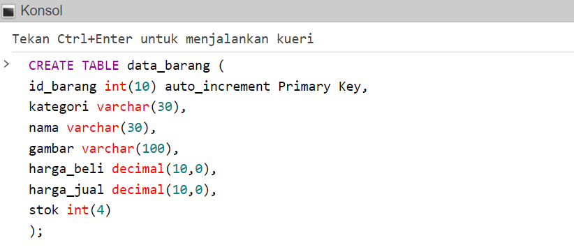
<p>Ini Tampilan di SQL:</p>

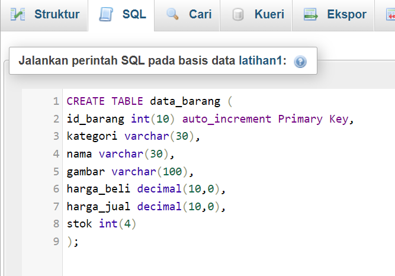

5. Kemudian Menambahkan Data dengan format :
```php
INSERT INTO data_barang (kategori, nama, gambar, harga_beli, harga_jual, stok)
VALUES ('Elektronik', 'HP Samsung Android', 'hp_samsung.jpg', 2000000, 2400000, 5),
('Elektronik', 'HP Xiaomi Android', 'hp_xiaomi.jpg', 1000000, 1400000, 5),
('Elektronik', 'HP OPPO Android', 'hp_oppo.jpg', 1800000, 2300000, 5);
```
Letakkan format di SQL atau Konsol, saat ini saya meletakkan di SQL
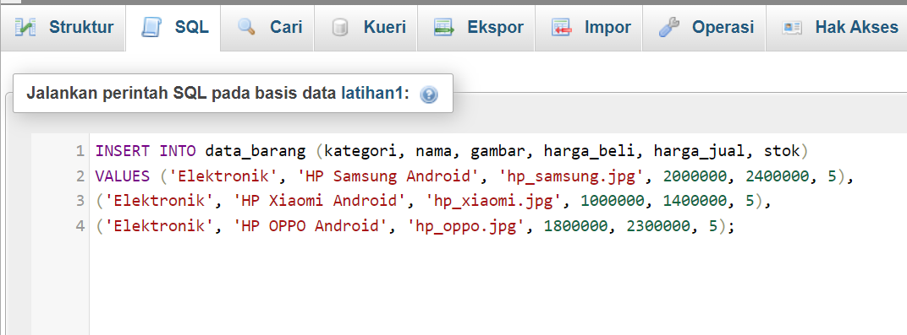
<br>Ini hasil formatnya
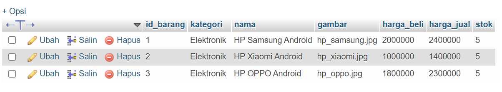

6. <b>Membuat Program CRUD</b>
<br>Saya akan membuat folder baru directory web server (d:\xampp\htdocs) dengan nama ```lab8_php_database```</br>
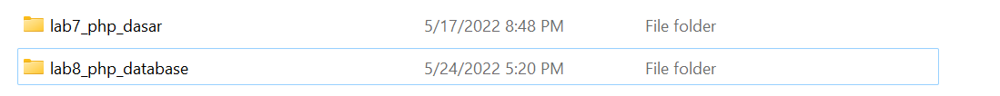
Kemudian untuk mengakses direktory tersebut pada web server dengan mengakses URL:
http://localhost/lab8_php_database/


7. Membuat file koneksi database <br>Buat file baru di VSC dengan nama ```koneksi.php``` dengan format </br>
```php
<?php
$host = "localhost";
$user = "root";
$pass = "";
$db = "latihan1";
$conn = mysqli_connect($host, $user, $pass, $db);
if ($conn == false)
{
echo "Koneksi ke server gagal.";
die();
} else echo "Koneksi berhasil";
?>
```
Buka melalui browser untuk menguji koneksi database (untuk menyampilkan pesan
koneksi berhasil, uncomment pada perintah echo “koneksi berhasil”;
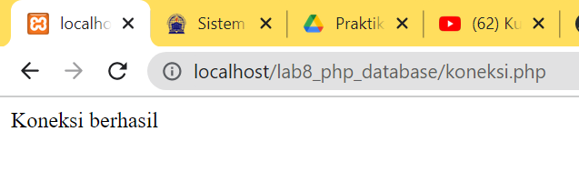

8. Membuat file index untuk menampilkan data (Read)<br>Buat file baru dengan nama index.php dengan format:
```php
<?php
include("koneksi.php");
// query untuk menampilkan data
$sql = 'SELECT * FROM data_barang';
$result = mysqli_query($conn, $sql);
?>
<!DOCTYPE html>
<html lang="en">
<head>
```
