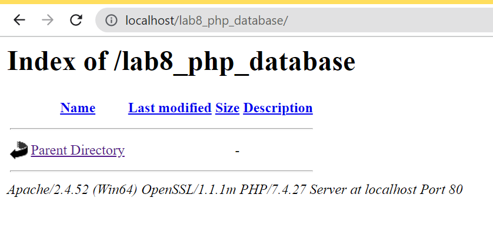
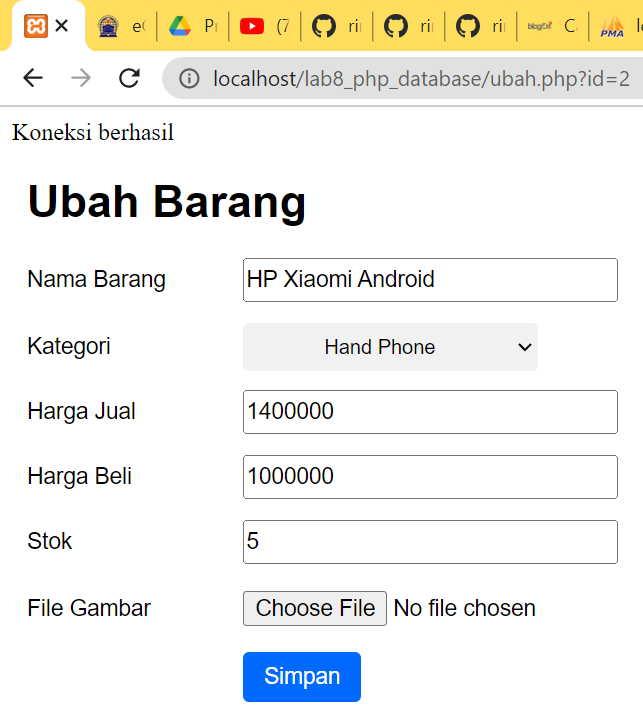

# Praktikum 8: PHP dan Database MySQL

<strong>Repository ini dibuat untuk memenuhi tugas Pemrograman Web</strong>
| <strong>Nama</strong>      | <strong>Riris Naomi Gurning</strong>  |
| ----------- | ----------- |
| <strong>NIM</strong>     | <strong>312010190</strong>       |
| <strong>Kelas</strong>   | <strong>TI.20.A.1</strong>        |

# Langkah-langkah Praktikum 8 "PHP dan Database MySQL"

1. Langkah pertama menyiapkan XAMPP 
 

2. Setelah muncul XAMPP, langkah selanjutnya menjalankan MySQL. Dengana Klik start Apache dan MySQL, kemudian klik admin pada bagian MySQL.
 <p>Kemudian buka
melalui browser: http://localhost/phpmyadmin/</p>Akan muncul seperti ini:


3. Setelah muncul seperti gambar diatas, langkah selanjutnya yaitu <b>Membuat Database baru di phpmyadmin dengan nama latihan1</b>

<br>Bisa juga dengan cara ketik ```<b>CREATE DATABASE latihan1;```</b>(didalam konsul)</br>


4. Langkah selanjutnya membuat tabel dengan format 
```php
CREATE TABLE data_barang ( id_barang int(10) auto_increment Primary Key,
kategori varchar(30),
nama varchar(30),
gambar varchar(100),
harga_beli decimal(10,0),
harga_jual decimal(10,0),
stok int(4)
);
```
<br>format dapat diletakkan di konsol atau SQL</br>
<br>Ini tampilan di Konsol:</br>

<p>Ini Tampilan di SQL:</p>


5. Kemudian Menambahkan Data dengan format :
```php
INSERT INTO data_barang (kategori, nama, gambar, harga_beli, harga_jual, stok)
VALUES ('Elektronik', 'HP Samsung Android', 'hp_samsung.jpg', 2000000, 2400000, 5),
('Elektronik', 'HP Xiaomi Android', 'hp_xiaomi.jpg', 1000000, 1400000, 5),
('Elektronik', 'HP OPPO Android', 'hp_oppo.jpg', 1800000, 2300000, 5);
```
Letakkan format di SQL atau Konsol, saat ini saya meletakkan di SQL

<br>Ini hasil formatnya


6. <b>Membuat Program CRUD</b>
<br>Saya akan membuat folder baru directory web server (d:\xampp\htdocs) dengan nama ```lab8_php_database```</br>

Kemudian untuk mengakses direktory tersebut pada web server dengan mengakses URL:
http://localhost/lab8_php_database/


7. Membuat file koneksi database <br>Buat file baru di VSC dengan nama ```koneksi.php``` dengan format </br>
```php
<?php
$host = "localhost";
$user = "root";
$pass = "";
$db = "latihan1";
$conn = mysqli_connect($host, $user, $pass, $db);
if ($conn == false)
{
echo "Koneksi ke server gagal.";
die();
} else echo "Koneksi berhasil";
?>
```
Buka melalui browser untuk menguji koneksi database (untuk menyampilkan pesan
koneksi berhasil, uncomment pada perintah echo “koneksi berhasil”;


8. Membuat file index untuk menampilkan data (Read)<br>Buat file baru dengan nama index.php dengan format:
```php
<?php
include("koneksi.php");
// query untuk menampilkan data
$sql = 'SELECT * FROM data_barang';
$result = mysqli_query($conn, $sql);
?>
<!DOCTYPE html>
<html lang="en">
<head>
    <meta charset="UTF-8">
    <link href="style.css" rel="stylesheet" type="text/css" />
<title>Data Barang</title>
</head>
<body>
    <div class="container">
        <h1>Data Barang</h1>
        <div class="main">
            <a href="tambsh.php">Tambah Barang</a>
            <table>
            <tr>
                <th>Gambar</th>
                <th>Nama Barang</th>
                <th>Katagori</th>
                <th>Harga Jual</th>
                <th>Harga Beli</th>
                <th>Stok</th>
                <th>Aksi</th>
            </tr>
            <?php if($result): ?>
            <?php while($row = mysqli_fetch_array($result)): ?>
            <tr>
                <td>" alt="<?= $row['nama'];?>"></td>
                <td><?= $row['nama'];?></td>
                <td><?= $row['kategori'];?></td>
                <td><?= $row['harga_beli'];?></td>
                <td><?= $row['harga_jual'];?></td>
                <td><?= $row['stok'];?></td>
                <td><?= $row['id_barang'];?></td>
                td><a href="hapus.php?id=<?php echo $d['id']; ?>">EDIT / HAPUS</a>
            </tr>
            <?php endwhile; else: ?>
            <tr>
                <td colspan="7">Belum ada data</td>
            </tr>
            <?php endif; ?>
            </table>
        </div>
    </div>
</body>
</html>

```
Hasil format di atas seperti ini:


9. Langkah selanjutnya ```Menambah Data (Create)```<br>Buat file baru dengan nama tambah.php dengan format:
```php
<?php
error_reporting(E_ALL);
include_once 'koneksi.php';
if (isset($_POST['submit']))
{
    $nama = $_POST['nama'];
    $kategori = $_POST['kategori'];
    $harga_jual = $_POST['harga_jual'];
    $harga_beli = $_POST['harga_beli'];
    $stok = $_POST['stok'];
    $file_gambar = $_FILES['file_gambar'];
    $gambar = null;
    if ($file_gambar['error'] == 0)
    {
        $filename = str_replace(' ', '_',$file_gambar['name']);
        $destination = dirname(__FILE__) .'/gambar/' . $filename;
        if(move_uploaded_file($file_gambar['tmp_name'], $destination))
        {
        $gambar = 'gambar/' . $filename;;
        }
    }
    $sql = 'INSERT INTO data_barang (nama, kategori,harga_jual, harga_beli,
    stok, gambar) ';
    $sql .= "VALUE ('{$nama}', '{$kategori}','{$harga_jual}',
    '{$harga_beli}', '{$stok}', '{$gambar}')";
    $result = mysqli_query($conn, $sql);
    header('location: index.php');
}
?>
<!DOCTYPE html>
<html lang="en">
<head>
    <meta charset="UTF-8">
    <link href="style.css" rel="stylesheet" type="text/css" />
    <title>Tambah Barang</title>
</head>
<body>
<div class="container">
    <h1>Tambah Barang</h1>
    <div class="main">
        <form method="post" action="tambah.php"
enctype="multipart/form-data">
            <div class="input">
                <label>Nama Barang</label>
                <input type="text" name="nama" />
            </div>
            <div class="input">
                <label>Kategori</label>
                <select name="kategori">
                    <option value="Komputer">Komputer</option>
                    <option value="Elektronik">Elektronik</option>
                    <option value="Hand Phone">Hand Phone</option>
                </select>
            </div>
            <div class="input">
                <label>Harga Jual</label>
                <input type="text" name="harga_jual" />
            </div>
            <div class="input">
                <label>Harga Beli</label>
                <input type="text" name="harga_beli" />
            </div>
            <div class="input">
                <label>Stok</label>
                <input type="text" name="stok" />
            </div>
            <div class="input">
                <label>File Gambar</label>
                <input type="file" name="file_gambar" />
            </div>
            <div class="submit">
                <input type="submit" name="submit" value="Simpan" />
            </div>
        </form>
    </div>
</div>
</body>
</html>
```
Dengan hasil format diatas sebagai berikut:


10. Kemudia Buat file baru dengan nama ```ubah.php``` untuk <b>Mengubah Data (Update)</b> dengan format seperti dibawah ini:
```php
<?php
error_reporting(E_ALL);
include_once 'koneksi.php';
if (isset($_POST['submit']))
{
    $id = $_POST['id'];
    $nama = $_POST['nama'];
    $kategori = $_POST['kategori'];
    $harga_jual = $_POST['harga_jual'];
    $harga_beli = $_POST['harga_beli'];
    $stok = $_POST['stok'];
    $file_gambar = $_FILES['file_gambar'];
    $gambar = null;
    if ($file_gambar['error'] == 0)
    {
        $filename = str_replace(' ', '_', $file_gambar['name']);
        $destination = dirname(__FILE__) . '/gambar/' . $filename;
        if (move_uploaded_file($file_gambar['tmp_name'], $destination))
        {
            $gambar = 'gambar/' . $filename;;
        }
    }
    $sql = 'UPDATE data_barang SET ';
    $sql .= "nama = '{$nama}', kategori = '{$kategori}', ";
    $sql .= "harga_jual = '{$harga_jual}', harga_beli = '{$harga_beli}', stok
= '{$stok}' ";
    if (!empty($gambar))
        $sql .= ", gambar = '{$gambar}' ";
    $sql .= "WHERE id_barang = '{$id}'";
    $result = mysqli_query($conn, $sql);
    header('location: index.php');
}
$id = $_GET['id'];
$sql = "SELECT * FROM data_barang WHERE id_barang = '{$id}'";
$result = mysqli_query($conn, $sql);
if (!$result) die('Error: Data tidak tersedia');
$data = mysqli_fetch_array($result);
function is_select($var, $val) {
    if ($var == $val) return 'selected="selected"';
    return false;
}
?>
<!DOCTYPE html>
<html lang="en">
<head>
    <meta charset="UTF-8">
    <link href="style.css" rel="stylesheet" type="text/css" />
    <title>Ubah Barang</title>
</head>
<body>
<div class="container">
    <h1>Ubah Barang</h1>
    <div class="main">
        <form method="post" action="ubah.php"
enctype="multipart/form-data">
        <div class="input">
            <label>Nama Barang</label>
            <input type="text" name="nama" value="<?php echo
$data['nama'];?>" />
        </div>
        <div class="input">
            <label>Kategori</label>
            <select name="kategori">
                <option <?php echo is_select
('Komputer', $data['kategori']);?> value="Komputer">Komputer</option>
                <option <?php echo is_select
('Komputer', $data['kategori']);?> value="Elektronik">Elektronik</option>
                <option <?php echo is_select
('Komputer', $data['kategori']);?> value="Hand Phone">Hand Phone</option>
            </select>
            </div>
            <div class="input">
                <label>Harga Jual</label>
                <input type="text" name="harga_jual" value="<?php echo
$data['harga_jual'];?>" />
            </div>
            <div class="input">
                <label>Harga Beli</label>
                <input type="text" name="harga_beli" value="<?php echo
$data['harga_beli'];?>" />
            </div>
            <div class="input">
                <label>Stok</label>
                <input type="text" name="stok" value="<?php echo
$data['stok'];?>" />
            </div>
            <div class="input">
                <label>File Gambar</label>
                <input type="file" name="file_gambar" />
            </div>
            <div class="submit">
            <input type="hidden" name="id" value="<?php echo
$data['id_barang'];?>" />
                <input type="submit" name="submit" value="Simpan" />
            </div>
        </form>
    </div>
</div>
</body>
</html>
```
11. Supaya Data Dapat Dihapus (Delete)<br>Buatlah file baru dengan nama ```hapus.php``` dengan format:
```php
<?php
include_once 'koneksi.php';
$id = $_GET['id'];
$sql = "DELETE FROM data_barang WHERE id_barang = '{$id}'";
$result = mysqli_query($conn, $sql);
header('location: index.php');
?>
```
Ketika klik hapus pada bagian Hp Samsung Android maka data Hp Samsung Android akan menghilang tampilannya seperti ini:


# SEKIAN DAN TERIMAKASIH

